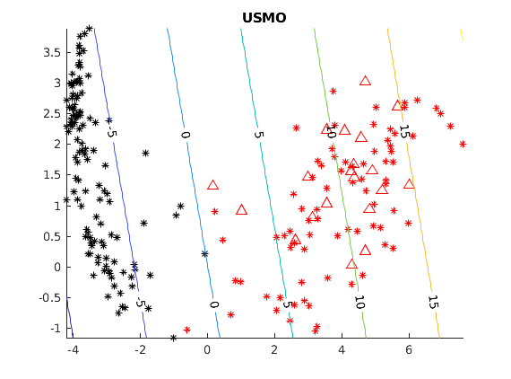
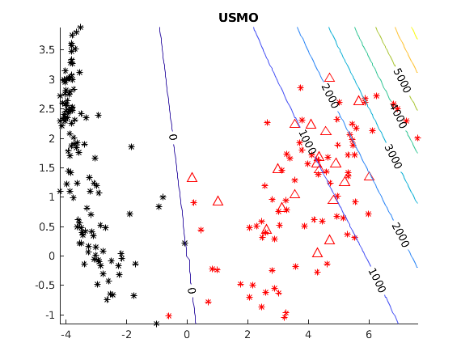
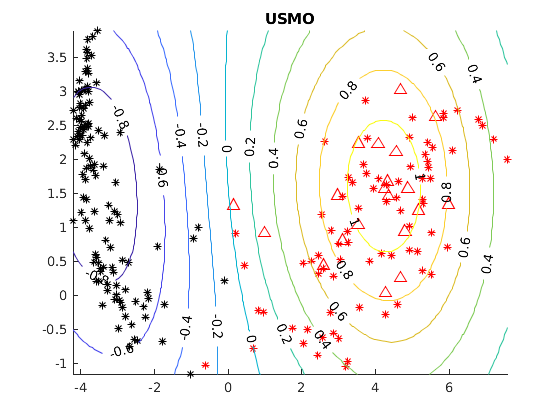

# USMO (Unlabeled data in Sequential Minimal Optimization)

Matlab code for paper [Efficient Training for Positive Unlabeled Learning](https://arxiv.org/abs/1608.06807)

### How to run the code

1. **Install dependencies**.
Download [LIBSVM](https://www.csie.ntu.edu.tw/~cjlin/libsvm/#download),
extract the archive into the main directory of USMO and finally compile
the Matlab version of LIBSVM (use the **make.m** file in the uncompressed
folder).

2. Use **demo1.m** and **demo2.m** as examples to call USMO routine.

### Demo 1

Classification of MNIST dataset (after applying PCA to visualize data)

| Linear kernel | Polynomial kernel | Gaussian kernel |
|---|---|---|
|  |  |  |

**Legend**. Red and black points are positive and negative samples, respectively.
Triangles are used to identify labeled samples.

### Licensing

The code is provided "as-is" under the terms of General Public License v2. 
See ```LICENSE.txt``` for full details.


